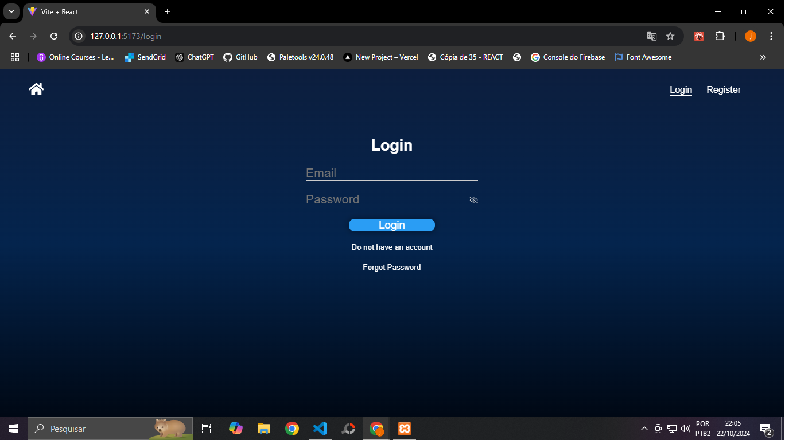
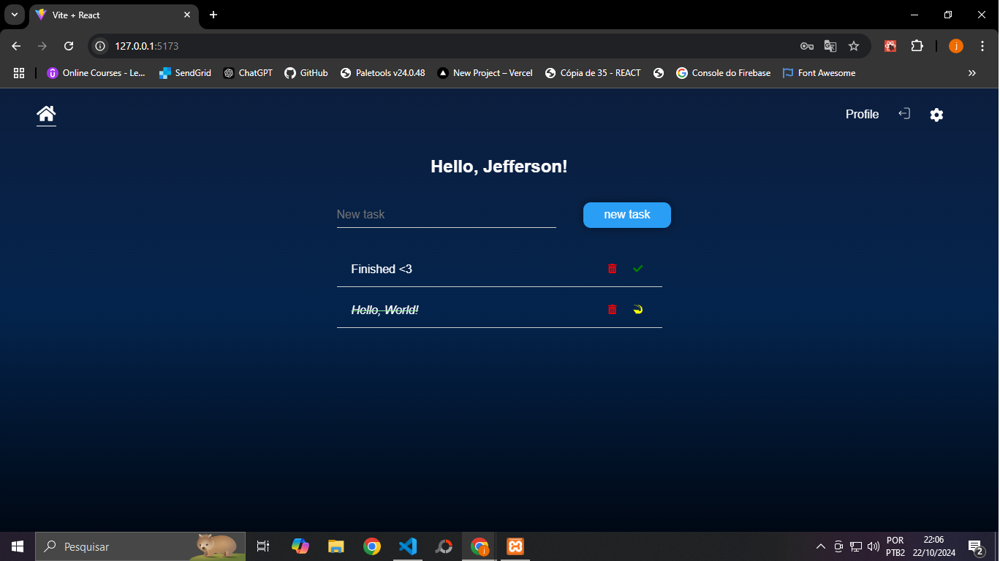
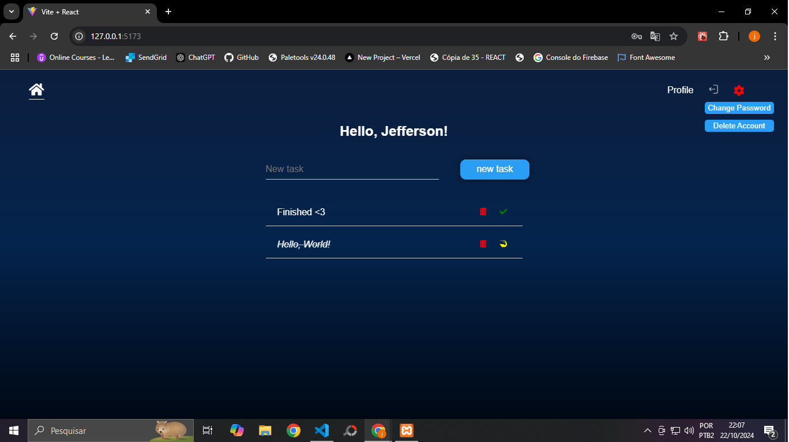

# Front-end do projeto Tasks List

## Imagens

<details>
<summary> Login </summary>

</details>
<details>
<summary> Home </summary>

</details>
<details>
<summary> Botão Gear </summary>

</details>
<details>
<summary> Logout </summary>

</details>

## Descrição
Construído em React com o propósito de realizar uma lista de tarefas com um sistema de autenticação, armazenamento e manipulação de dados utilizando o MySQL como database e este [backend](https://github.com/jeffmazz/backend_tasks) para se relacionar e realizar o processamento dos dados.

---

## Como usar

Inicialmente precisamos ter um usuário cadastrado no banco de dados e após isso realizar o login.

Caso não possua um cadastro você pode estar realizando um clicando em Registro no canto superior direito da página, no menu de navegação.

Realizando o login você poderá armazenar suas tarefas de forma rápida, marcá-las como concluídas ou pendentes ou até excluí-las da sua lista.

Trocar a senha também é uma opção, você pode fazer isso ao passar o mouse sobre a engrenagem localizada no canto superior direito da interface que mudará após a realização do login.

lembrando que para que tudo funcione corretamente precisamos também configurar o [backend](https://github.com/jeffmazz/backend_tasks) da aplicação.

---

## Tecnologias Utilizadas
- HTML
- CSS
- React - JSX

---

## Dependências
- **react-icons**: para ícones
- **react-router-dom**: para roteamento
- **react-tooltip**: para tooltips

---

## Funcionalidades

<details>
    <summary> Barra de Navegação </summary>
    <ul>
        <li> Caso não esteja logado:
            <ul>
                <li> 🏠: Redirecionamento para a página de login </li>
                <li> <strong>Login:</strong> Acesso à página de login </li>
                <li> <strong>Register:</strong> Acesso à página de cadastro </li>
            </ul>
        </li>
        <li> Caso esteja logado:
            <ul>
                <li> 🏠: Acessar a página inicial (home) </li>
                <li> <strong>Perfil:</strong> Acesso às suas informações </li>
                <li> <strong>Sair:</strong> Realização de logout fornecido pelo authContext </li>
                <li> ⚙️: Opções de alteração de senha e deletar conta
                   <ul>
                       <li> Alteração se senha
                           <ul>
                               <li> Após clicar na opção será enviado uma mensagem para o e-mail cadastrado contendo um link com token </li>
                               <li> Ao clicar no link você será direcionado para a página de alteração de senha </li>
                               <li> Caso você não esteja logado ao clicar no link você será redirecionado à página de login e ao realizar o login você voltará a pagina de alteração de senha para informar a senha antiga e a nova senha para fazer a atualização </li>
                               <li> Caso esteja logado você precisará apenas informar a antiga e nova senha para realizar a alteração </li>
                               <li> Caso ocorra algum erro durante o processo uma mensagem de erro será exibida na tela informando que a senha antiga não está correta ou que as novas senhas não batem </li>
                           </ul>
                       </li>
                   </ul>
                 </li>
            </ul>
        </li>
    </ul>
</details>

<details>
    <summary> Página de Login e Registro </summary>
    <ul>
        <li> Caso esteja logado:
            <ul>
                <li> Redirecionamento para a página inicial </li>
            </ul>
        </li>
         <li> Caso não esteja logado:
            <ul>
                <li> <strong>Login</strong>
                    <ul>
                        <li> Informar e-mail e senha para realização de Login </li>
                        <li> Caso as informações estejam incorretas uma mensagem de erro aparecerá na tela informando o erro ocorrido. Exemplo: Senha incorreta. </li>
                        <li> Caso estejam corretas um token será gerado no backend utilizando JWT e posteriormente devolvido ao front onde será armazenado no localStorage para autenticação </li>
                    </ul>
                </li>
                <li> <strong>Registro</strong>
                    <ul>
                        <li> Preencher o formulário com nome, e-mail, senha e confirmação de senha para realização de cadastro </li>
                        <li> Caso algum campo único já exista no banco de dados, uma mensagem de erro aparecerá na tela informando o erro ocorrido. Exemplo: E-mail já existente. </li>
                        <li> Caso esteja tudo certo um cadastro será realizado no banco de dados e um e-mail será enviado para o e-mail informado para a ativação da conta </li>
                    </ul>
                 </li>
            </ul>
        </li>
    </ul>
</details>

<details>
    <summary> Funcionalidades da Home </summary>
    <ul>
        <li> Caso não esteja logado:
          <ul>
            <li> Redirecionamento para a página de Login </li>
          </ul>
        <li> Caso esteja logado:
            <ul>
                <li> <strong>Adicionar tarefas:</strong> Clicando no botão adicionar ou apertando enter após preencher o campo de descrição de tarefa no centro da página </li>
                <li> <strong>Visualização das tarefas:</strong> Caso existam tarefas associadas à sua conta uma lista contendo todas as tarefas será exibida logo abaixo do campo de adição de tarefas </li>
                <li> <strong>Remover tarefas:</strong> Clicando no ícone 🗑️ presente no canto direto de cada tarefa </li>
                <li> <strong>Alternar entre tarefa concluída e pendente:</strong> Clicando no ícone ao lado da lixeira que alterna entre ✔️ e 🔄 </li>
            </ul>
        </li>
    </ul>
</details>

<details>
  <summary> Recuperação de Senha </summary>
  <ul>
      <li> Clique no botão Esqueci minha senha Localizado na página de login </li>
      <li> Você será redirecionado para uma página onde deverá informar seu e-mail </li>
      <li> Após informar uma mensagem será enviada para o seu e-mail contendo um link com token único </li>
      <li> Ao clicar no link você entrará em uma página onde pode criar uma nova senha para aquele e-mail </li>
  </ul>
</details>

<details>
  <summary> AuthContext </summary>
  <ul>
    <li> Verificar se o usuário está logado baseado no token gerado pelo Login presente no localStorage
      <ul>
        <li> Caso não exista um token ele definirá que o usuário não está autenticado </li>
      </ul>
    </li>
    <li> Decodifica o token fazendo uma chamada ao backend e distribui às informações presentes nele para variáveis que serão distribuídas por toda a aplicação </li>
    <li> Função de Logout que remove o token presente no localStorage e atribui o usuário como não autenticado </li>
  </ul>
</details>

---

## Instalação
- Certifique-se de que tenha o Node e o NPM Instalados.
- Você pode verificar utilizando os seguintes comandos:
```bash

node -v
npm -v
```
- Após isso
``` bash

// Clone o Repositório
git clone https://github.com/jeffmazz/frontend_tasks.git

// Navegue até a pasta do projeto
cd ./frontend

// Instale as dependências
npm install

// Execute o servidor
npm run dev
```

---

## Licença
**MIT**

---

## Considerações Finais
Este projeto foi desenvolvido como parte do meu aprendizado e pode estar sujeito a melhorias. Estou aberto a feedbacks e sugestões.
Caso queira você também pode visualizar o projeto por completo clicando [aqui](https://github.com/jeffmazz/backend_tasks) para acessar o backend.
